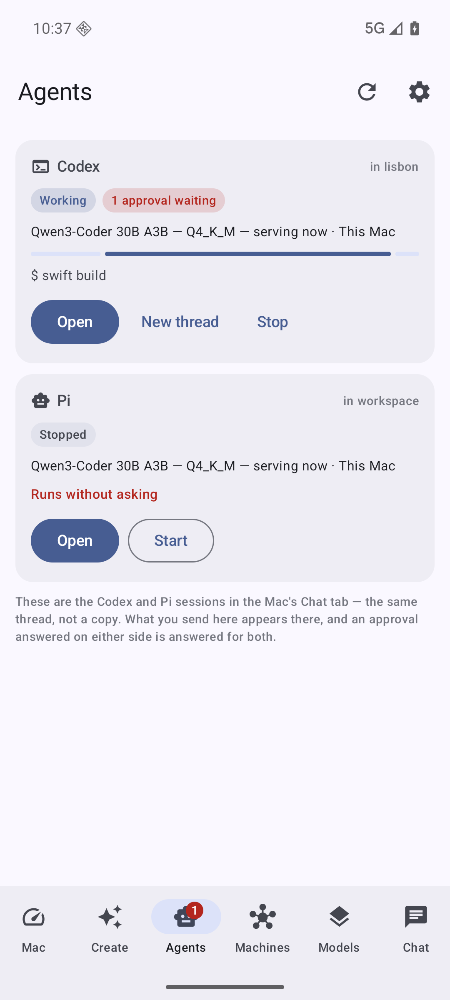
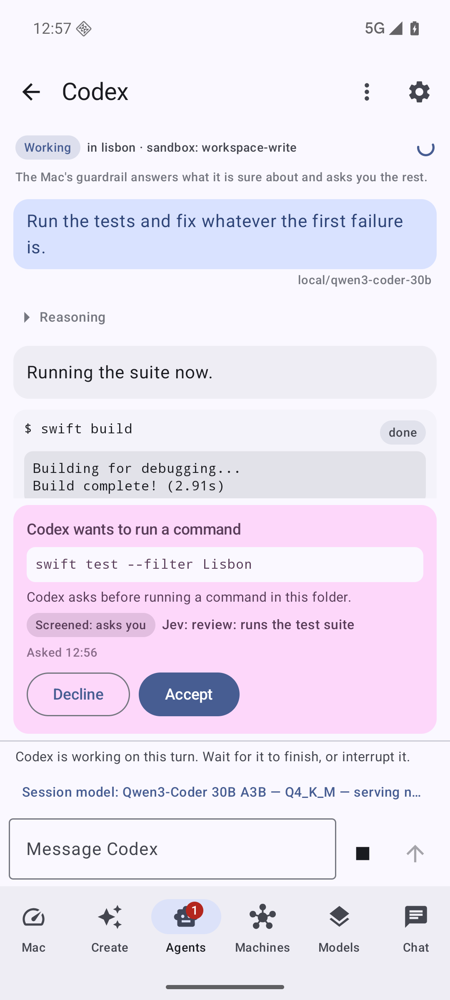
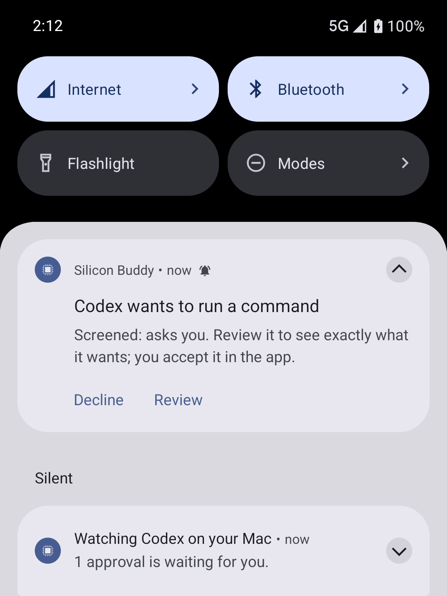
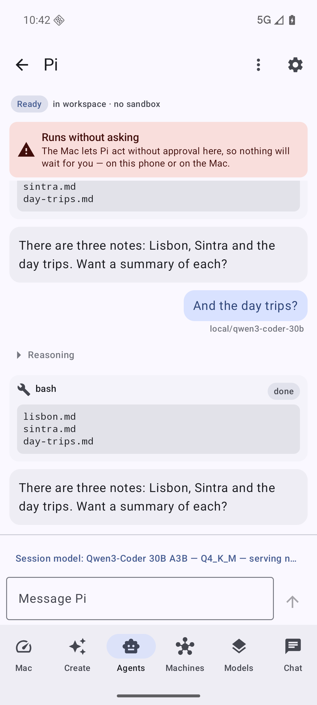

# Silicon Buddy

The phone and tablet companion to [Silicon Optimizer](https://github.com/OGZamasu/silicon-optimizer)
and [silicon-node](https://github.com/OGZamasu/silicon-node). Everything the Mac can do —
chat with any loaded or cloud model, install and load models, run image, video and 3D jobs on
the Mac or the node, drive agent sessions, ask the swarm — from an Android phone or an iPad,
over your own tailnet. Nothing public, no relay, no account.

- `ios/` — Swift and SwiftUI, iPhone and iPad. Pairing, dashboard, models and chat, plus
  a Home and Lock Screen widget, a share extension, camera mode, push-to-talk and three
  App Intents for Siri and Shortcuts.
- `android/` — Kotlin and Jetpack Compose, phone and tablet. The same, with a Glance
  widget, a Quick Settings tile, a share target and launcher shortcuts, plus the
  Create tab (video, image and 3D, and the Mac's render queue), the Machines page, the
  Agents tab (the Mac's Codex and Pi sessions, driven and approved from the phone), and a
  small model of its own for when the Mac is out of reach (`android/llama`, llama.cpp).
- `third_party/llama.cpp` — llama.cpp b11053, a submodule: clone with `--recursive`, or
  `git submodule update --init --depth 1 third_party/llama.cpp`.
- `contract/` — the control API as JSON fixtures exported by the Mac app's own
  `ContractExportTests`, plus `routes.md`. Both apps round-trip every type against these,
  so a change on the Mac fails a build here before it fails a user. Re-export with
  `./contract/refresh.sh`.
- `docs/PLAN.md` — the milestones and the decisions behind them.

Two native apps on purpose: they share the contract and the design, not code.

## Reaching in

Most of what you want from the Mac is one question, and opening an app to ask it is
three steps too many. So the question can start from a widget, from another app's share
sheet, from the camera, from the microphone, or from Siri and the Assistant — and every
one of them goes through the same `TailnetHost` gate and the same paired token as the
app itself.

| | iOS | Android |
|---|---|---|
| Widget | Home Screen (small and medium) and a Lock Screen accessory, with a configurable preset question the widget fires itself | Glance widget with the same content and button |
| One tap to the composer | The widget's "Ask", a `siliconbuddy://ask` deep link | The widget, the Quick Settings tile, the launcher's long-press menu |
| Share | Share extension: text, a link or up to eight pictures | Share target, the same |
| Camera | AVFoundation, question first, shutter sends | CameraX, the same |
| Voice | Hold to talk, `SFSpeechRecognizer` on-device where the phone can, `AVSpeechSynthesizer` for the reply | `SpeechRecognizer` with `EXTRA_PREFER_OFFLINE`, `TextToSpeech` for the reply |
| Assistant | App Intents: "Ask my Mac", "Load a model", "What is loaded on my Mac" | Static and dynamic shortcuts bound to the same three |

A link never sends anything. `siliconbuddy://ask?text=…` fills the composer in and
stops there, because anything on the phone can open a URL in this app.

The token lives in the Keychain under a shared access group on iOS, and in
`EncryptedSharedPreferences` on Android where every surface is the same process. The
address and the last answer live in an app group container; the token never does.

None of it is backed up. On iOS the shared container is marked
`isExcludedFromBackup`, which covers the group's preferences file inside it; on Android
`res/xml/data_extraction_rules.xml` excludes every shared-preferences file from both
cloud backup and device transfer. The token is stored device-only on both and so is
never restored anywhere, and a backup that carried the address without it would restore
half a pairing that cannot work. The last answer is a piece of a conversation and stays
on the phone that heard it.

## Making things

The Create tab starts a render on the owner's machines: a clip through the Mac's
queue, an image, or a mesh from a picture the Mac already has. The queue screen is
`GET /video/queue` and the `job` events on `/events` read together — the queue knows
what the work is and why it failed, the events know how far along it is — and its
buttons are the Mac's own words: pause, resume, retry, remove, stop following, clear
finished. There is no cancel, because a clip already handed to a node keeps rendering
there, and the Mac will not claim otherwise.

A render takes minutes, so a request that has to be waited for runs in a foreground
service behind an ongoing notification, and a local notification says when the work is
done or has failed. Tapping it opens the queue.

Results come back as ids, and `GET /media/{id}` answers the bytes — so a finished clip
or picture is saved into the phone's own photo library, and a picture on the phone goes
the other way through `POST /uploads` to become the mesh the Mac makes or the still it
animates. Neither direction names a path: a request from a paired device that names a
file on the Mac is refused, because a device that could name one could name any of them.
A chat-only device may fetch the preview images and not the renders, which is the Mac's
rule and is what the buttons follow.

The Machines page is this Mac and every machine it can hand work to, one card each:
chip and cores, what is loaded, memory and pressure, GPU and CPU, the lanes each one
advertises. A peer's card is what the Mac's last poll saw, and "Ask it now" replaces it
with what the node says this second — including the adapter riding on its loaded GGUF,
which a poll cannot carry.

## Agent sessions

The Agents tab is the Mac's Chat tab seen from the phone — Codex and Pi, one card each —
and it is a second screen on the session that is already there, not a second session.
What the phone sends appears in the Mac's own transcript; an approval answered on either
side is answered once, for both; a new thread started on the Mac clears the phone's
transcript too. Every agent route runs commands on the Mac, so a device paired for chat
does not get the tab at all, and Settings says why in one line.

| | |
|---|---|
|  |  |
|  |  |

A card says what the engine is doing, which model its next turn will use, the folder
it works in, and how many calls are waiting for a person; starting an engine is one tap,
and stopping one or starting a new thread asks first, because both throw something away
on the Mac. The session is the transcript in the one vocabulary the Mac maps both
engines onto — prose, a command with what it printed, a file change, a tool, a notice,
an error — with the engine's thinking folded away until asked for. Output scrolls inside
its own row, and the Mac sends only the tail of a long log, which the row says.

**Keeping in step.** The transcript is read once, whole, and then kept by the `agent`
frames on the same `/events` stream the rest of the app uses. Every frame and every read
carries the transcript's *epoch*, which changes with a new thread and with every launch
of the Mac's app, so rows from a transcript that has gone are never merged into the one
that replaced it. The phone resumes from how far its rows are known to be complete — not
from the highest number it has seen — so a stream that dropped, a Mac that had to drop
frames for a slow phone (`resync`), or a read answered before the stream opened are all
caught up with `?since=&epoch=` rather than leaving a hole — in the transcript's own order,
even when rows streamed in while the catch-up was out. Off screen the app closes its stream
and stops polling the Mac's metrics; coming back opens the stream again at once and asks
each engine once for what it missed.

**Approvals.** The Mac's guardrail screens each call first and answers what it is sure
about; what reaches the phone is what it left to a person, with its verdict — "Jev:
review: destructive" — exactly as the Mac's card shows it. One card at a time, oldest
first, its Accept and Decline pinned below a body that scrolls, so they stay in reach at
any text size and on a phone turned on its side, where the card stands beside the
transcript. While a card is on screen, other apps' overlays are hidden (Android 12 and
later), and a press that went through another app's window at the point pressed is
refused rather than sent — a window over some other part of the screen, a video call in a
corner, refuses nothing, and neither does the next answer from a keyboard or switch
access. Answered at the Mac first, the card says so and comes down; gone for any other
reason, it comes down quietly; and a card answered on the Mac while the phone was looking
comes down by itself, saying which way it went and whose answer it was: this phone's only
when the Mac's word matches what this phone sent, and never once the Mac has turned that
answer away. The tab's badge — which a screen reader says too — counts what is waiting,
and so does the Quick Settings tile. If the Mac stops knowing this phone (a 401), the app
stops asking it anything — the agents, the metrics, the status — and offers to pair
again.

**In your pocket.** Leave the app while a turn is running in a session you opened, and a
foreground service keeps watching it (`remoteMessaging`, the type Android 14 has for
carrying on a conversation that lives on another device). Each approval gets one
notification saying which engine wants to do what kind of thing — "Codex wants to run a
command" — and what the guardrail made of it, and nothing else: not the command, not the
paths, not the reason, not any output. Android shows a notification's content on the lock
screen unless you have chosen to hide sensitive content there, which is not the default,
so what exactly the agent wants stays in the app, after unlocking. For the same reason
nothing in the shade can allow it: its buttons are Decline, which is safe to give without
reading, and Review, which opens the app on that approval's card, where Accept is — under
the command it would run. On Android 12 and later both require the phone to be unlocked
(`setAuthenticationRequired`), and the app checks the lock again when a Decline arrives —
a notification listener or a watch can press a button without the system's prompt —
refusing on a locked phone after giving a fresh unlock a second to register; on older
Android the one button is Review. The service lets go when the turn ends; when nothing
has come from the Mac for a minute, however often the stream has been dialled again, so a
Mac relaunching or a phone changing networks does not end it; at once if the Mac says
this phone is no longer paired, saying so; when the notification is dismissed; or when
the app comes back. On Android 13 and later a session screen leaves no Recents thumbnail.

**Runs without asking.** When the Mac says a session asks nobody — Pi with the guardrail
off, Codex under "never ask" — the session carries a banner that cannot be dismissed,
because it changes what the screen is for.

## When the Mac is out of reach

The Android app can answer on the phone itself, with a small GGUF model running on its own
CPU through llama.cpp — never on its own initiative, and never without saying so.

- **The model comes from the Mac, over the tailnet, and nowhere else.** Settings → On this
  phone lists what the Mac offers (Qwen3.5 2B by default, 1.3 GB; Gemma 4 E2B, 3.35 GB,
  larger and slower on a phone), with size, licence and the phone's free space, and asks
  before anything moves. The Mac fetches the pinned file from Hugging Face and verifies
  it; the phone copies it in one resumable, ranged transfer — Wi-Fi only unless you say
  "use mobile data" for that download — and checks the SHA-256 again itself before it runs
  a byte of it. A mismatch is deleted, the Mac is asked once to check its own copy, and the
  file comes over once more. Full-control pairings only: a chat-only phone is told why.
- **Offered, never silent.** When the Mac does not answer — unreachable, the app not
  running, too slow, or no Mac paired — the chat says "Your Mac isn't answering" with
  **Answer on this phone** and **Try again**. Tapping the first starts a new conversation
  that lives only on the phone; every answer in it carries "On this phone · Qwen3.5 2B".
  The Quick Settings tile and the widget say "Mac unreachable · phone model ready" and
  open that offer; neither ever answers by itself.
- **Kept on the phone.** Those conversations are stored in the app's no-backup folder and
  listed apart ("On this phone — not synced"); nothing that talks to the Mac will take their
  ids. When the Mac is back: **New Mac conversation**, or **Send to Mac…**, which asks
  first and says how many messages go.
- **Guarded.** It refuses to load below the free memory the Mac measured for the model and
  offers the smaller one; it thins its threads when the phone is warm and stops only when
  it is critically hot ("Stopped — phone too hot"); it writes only while the app is on the
  screen, and lets the model go after 30 seconds in the background, at once when Android
  asks for memory back, or after five idle minutes.

## Building

Both apps talk to Silicon Optimizer over your tailnet, and to nothing else: every
request is checked against `TailnetHost` first — loopback, `10.0.2.2` for the Android
emulator, Tailscale's `100.64.0.0/10` and `fd7a:115c:a1e0::/48`. A scanned QR or a
`siliconbuddy://` link never pairs on its own; it names the machine and asks.

```
# iOS — Xcode 26, xcodegen 2.46
cd ios && xcodegen generate
xcodebuild -scheme SiliconBuddy -destination 'platform=iOS Simulator,name=iPad mini (A17 Pro)' build test

# Android — the JDK inside Android Studio, SDK 35, NDK 29.0.14206865, the SDK's CMake 3.22.1
git submodule update --init --depth 1 third_party/llama.cpp
cd android && JAVA_HOME="/Applications/Android Studio.app/Contents/jbr/Contents/Home" ./gradlew test assembleDebug

# The local CI (GitHub Actions cannot run here): unit tests, the minified release, the keep
# rules R8 cannot see, the native libraries and the 30 MB APK budget; --connected adds the
# instrumented tests on $ANDROID_SERIAL, --ios the iOS suite.
scripts/ci-android.sh
```

llama.cpp's CMake fetches Arm's KleidiAI sources at configure time, pinned there by version
and checksum; an offline machine can pass `-Pbuddy.kleidiaiSource=<unpacked folder>`. The
native part is arm64 only: a build for another ABI carries no llama.cpp, and the app says
the phone's own model is not available.

The generated `ios/SiliconBuddy.xcodeproj` is not committed: `project.yml` is the source.
