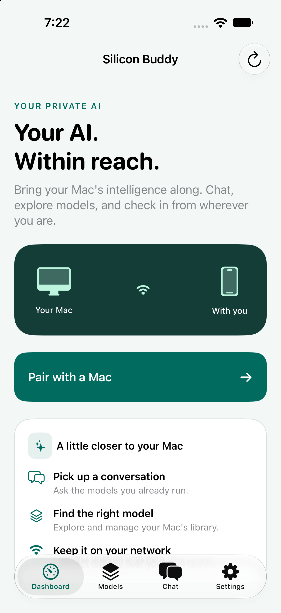
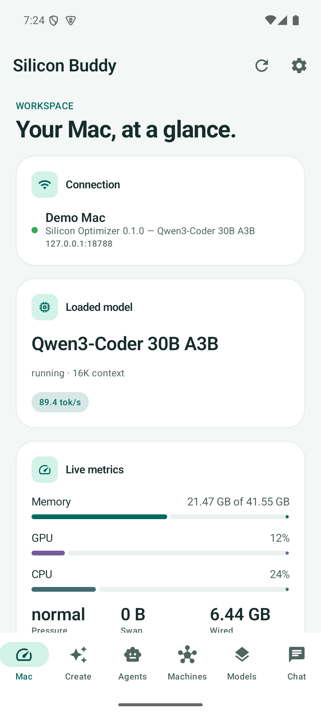
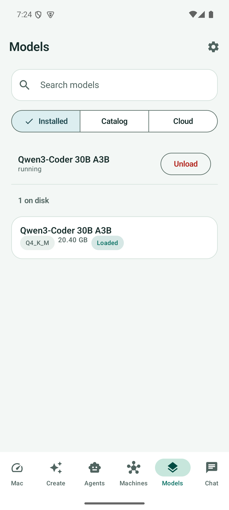

# Mobile interface refresh

The Android and iOS apps share a teal accent, warm neutral backgrounds, clearer
headings, and rounded cards. First launch introduces the app and offers a single
pairing action. Shared components carry the styling through dashboard metrics,
model lists, chat, and empty states. Both themes support system text sizing.

These captures use an iPhone 18 Pro simulator and an Android API 35 emulator.
**Demo Mac is a local UI fixture.** Its model and metrics are sample contract data,
not inference measurements. The demo server is test tooling, not an app feature.

| iOS first launch | Android dashboard | Android models |
| --- | --- | --- |
|  |  |  |

Validation: Android JVM tests and debug build, iOS build and 275 tests, and an
Android emulator smoke check covering pairing, Chat, Models, and theme changes.
The dashboard was also inspected at 150% Android font scale. This is not a claim
of physical-device, real-model, or complete accessibility coverage.
